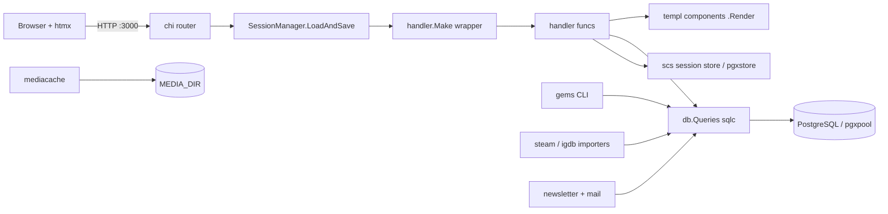

# Repository Guidelines

## Project Overview

Indie Game Gems (`github.com/embiem/indie-game-gems`) — a curated indie-game
discovery site: Game of the Day, Weekly Release Radar, Top of the Month,
game/developer pages with store buttons, and a double-opt-in email newsletter.
Go 1.25, chi, templ, sqlc + pgx/v5, golang-migrate, scs sessions, Tailwind v4,
htmx. Curation and imports run through the `gems` CLI (cobra) in `cmd/gems`;
data comes from the public Steam store API and IGDB.

## Architecture & Data Flow



- **Entry (`main.go`)**: `initialize()` loads `.env` (godotenv), runs
  `db.Init()` (applies pending migrations from `file://db/migrations`, opens
  the pgxpool) and `handler.InitSession()`. The chi router installs
  RequestID/RealIP/RequestLogger/Recoverer/Compress/Timeout,
  `util.SecurityHeaders`, `util.SameOriginOnly`; serves `/healthz`, static
  `/public` (1 h cache) and `/media` from `MEDIA_DIR` (1 y immutable).
  Graceful shutdown on SIGINT/SIGTERM.
- **Request flow**: chi route → `handler.Make(fn)` adapts an `error`-returning
  handler to `http.HandlerFunc` and logs failures via `slog.Error` → handler
  renders a templ component (`.Render(ctx, w)`), redirects, or returns an
  htmx partial. Public pages run under `handler.CacheControl("public,
  max-age=300")`.
- **Pages**: `/` home, `/games/{slug}`, `/developers/{slug}`,
  `/game-of-the-day[/{date}]`, `/release-radar[/{week}]`,
  `/top[/{year}/{month}]`, `/sitemap.xml`, `/robots.txt`, `/feed.xml`;
  auth `/login`, `/logout` (`/signup` routes exist in code but are commented
  out in `main.go`); newsletter `/newsletter`, `/newsletter/issues/{slug}`
  (snapshot archive), `/newsletter/confirm`, `/newsletter/subscribe`,
  `/newsletter/unsubscribe/{token}`. Auth (`/login`, `/logout`, the signup
  handlers/views and the users/accounts tables) is intentionally kept though
  signup is unregistered: user accounts will back favourites later.
- **Data layer**: `db/queries/*.sql` + `db/migrations/*.sql` →
  `sqlc generate` → `data/` package. sqlc reads **all** files in
  `db/queries/`; area files: `users.sql`, `catalog.sql`, `picks.sql`,
  `cli.sql`, `pages.sql`, `newsletter.sql`.
- **Importers**: `steam/` (appdetails + appreviews for catalogue sync, store
  search + batched keyless `IStoreBrowseService/GetItems` (≤100 appids per
  request) for release-date ranges, ≤1 req/s, retries on
  429/5xx, HTML→Markdown descriptions), `igdb/` (Twitch client-credentials
  token caching, Apicalypse, 4 req/s; credentials from `IGDB_CLIENT_ID` /
  `IGDB_CLIENT_SECRET`), `mediacache/` (atomic downloads into `MEDIA_DIR`,
  content-type validated, size-capped, skip-unless-forced).
- **Newsletter**: `newsletter/` (pure domain logic: issue parsing with
  directives, tokens, signup state; Renderer → `view/email` documents;
  resumable Sender), `mail/` (go-mail SMTP client with rate limit and
  `List-Unsubscribe` headers), `cmd/gems newsletter *` + `handler/newsletter.go`.

## Field ownership (seed vs importers)

`gems seed` (via `UpsertGame`/`UpsertDeveloper` in `db/queries/cli.sql`) is
safe to re-run at any time because ownership is explicit:

- **Seed owns**: title, tagline, gem_note_md, release_date/status,
  steam_appid, editorial_score, socials, seed tags/roles/store links.
- **Importer-only, never wiped by seed**: description_md, website_url
  (overwritten only when the seed value is non-empty —
  `COALESCE(NULLIF(EXCLUDED.x, ''), table.x)`), review stats, trailer,
  sync timestamps; `igdb_id` never cleared (`COALESCE(EXCLUDED.x, …)`).
- **Importers fill gaps only**: `SetGameSteamSync`, `SetGameIGDBSync`,
  `SetDeveloperIGDBSync` use CASE/COALESCE so curated fields win;
  `ImportStoreLink` / `ImportDeveloper` are `ON CONFLICT DO NOTHING`
  variants of the seed upserts.

## Key Directories

- `handler/` — `shared.go` (`Make`, `CacheControl`, session keys), `session.go`,
  `pages.go` (discovery pages, sitemap/feed), `newsletter.go` (+ email-archive
  CSP override), `auth.go`, `cache.go`.
- `view/` — templ views (edit `*.templ`, never `*_templ.go`): `layout`,
  `home`, `gotd`, `radar`, `top`, `game`, `developer`, `newsletter`, `errors`,
  `stores` (store buttons), `tile`, `meta`; `media.go` (`MediaURL(key)`) and
  `pages.go`. `view/email/` renders newsletter emails (templ components +
  hand-written `document.go`/`text.go`/`render.go`).
- `catalog/` — domain logic: `scoring.go` (gem score), `seed.go` (seed YAML
  parse/validate), `rotation.go` (pick rotation), `sync.go`/`sync_media.go`
  (Steam/IGDB/media orchestration), `catalogue.go`.
- `steam/`, `igdb/`, `mediacache/` — API clients + downloader (fixtures in
  their `testdata/`).
- `newsletter/`, `mail/` — see above. Issues live in `newsletter/issues/`;
  `newsletter/templates/weekly.md` is the `gems newsletter new` scaffold.
- `data/` — **generated** sqlc output. Do not edit.
- `db/` — `init.go` (migrations + pool), `queries/`, `migrations/`.
- `util/` — `security.go` (CSP, SameOriginOnly), `markdown.go`, `period.go`,
  `httplog.go`.
- `public/` — static assets incl. self-hosted fonts, vendored htmx, generated
  `output.css` (committed).
- `seed/games.yaml` — curated seed file.

## Commands

```bash
cp .env.example .env
docker compose up -d                 # dev: db (:5432 via POSTGRES_PORT), adminer, mailpit
air                                  # live-reload dev loop (.air.toml)
go test ./...                        # hermetic unit tests
templ generate                       # after editing *.templ
sqlc generate                        # after editing db/queries/*.sql
tailwindcss -i input.css -o public/output.css --minify   # CSS
migrate create -ext sql -dir db/migrations -seq <name>   # then up/down/force
```

Curation CLI (`go run ./cmd/gems` or `/gems` in the Docker image) — see
README for the full list: `seed`, `games add|list`, `rescore`, `steam sync|releases`,
`igdb sync|catalogue`, `media fetch`, `link set|rm`, `pick set|auto|list`,
`refresh`, `newsletter new|preview|test|send|subscribers|issues`.

## Conventions

- **Handlers**: `func(w, r) error` via `handler.Make`; page handlers
  `Get<Name>Page`, form actions `Post<Name>`; views are exported templ funcs.
- **Queries**: PascalCase names, one area file per domain in `db/queries/`;
  card-shaped reads select from the `game_cards` view (migration 000013) so
  listings share one `data.GameCard` row type. Every query's WHERE/JOIN/ORDER
  must be served by an existing index (or a migration adding one, with the
  matching drop in `.down.sql`).
- **Migrations**: one numbered migration per change, `BEGIN`/`COMMIT`, working
  `.down.sql`. golang-migrate applies pending numbers on startup — never
  rewrite a migration already applied to a shared database; take the next
  free number instead.
- **Media**: the DB stores keys relative to `MEDIA_DIR`
  (`games/<slug>/header.jpg`, `capsule.jpg`, `hero.jpg`, `cover.jpg`,
  `screenshot-01.jpg`…, `developers/<slug>/logo.<ext>`); views resolve them
  exclusively through `view.MediaURL(key)` so the CDN switch is config-only.
  The media cache is a runtime volume, never baked into the image.
- **CSP**: site-wide policy in `util/security.go` — everything same-origin
  (`/public`, `/media`); no inline scripts or styles; the only third-party
  frame is the click-to-load `youtube-nocookie.com` trailer facade. The
  newsletter snapshot archive (`handler/newsletter.go`) overrides the CSP
  because archived emails rely on inline styles. Keep policies in sync with
  what templates actually load.
- **State/DI**: package globals (`db.Queries`, `db.Pool`,
  `handler.SessionManager`); no DI container.
- **DB types**: sqlc emits `pgtype.*`; importers pass `nil`-able values and
  let SQL `COALESCE` decide (see field ownership above).

## Testing & QA

- `go test ./...` is hermetic (no DB, no network): unit tests for scoring
  boundaries, seed YAML validation, pick rotation, Steam/IGDB clients against
  `httptest` + fixtures (`steam/testdata`, `igdb/testdata`), media download
  validation, newsletter parsing/tokens/signup state, mailer, markdown,
  security headers, store buttons, email rendering.
- DB integration is verified manually via migrations up/down and the `gems`
  CLI against the compose database.
- Place `*_test.go` beside the code; air excludes `_test.go` and
  `*_templ.go`.

## Important Files

- `main.go` — route table, middleware, file servers, bootstrap.
- `db/init.go` — migrations + pgxpool + `data.Queries`.
- `sqlc.yaml` — queries `db/queries/`, schema `db/migrations`, out `data/`,
  `sql_package: pgx/v5`.
- `Dockerfile` — two-stage build: `/server` + `/gems`, Tailwind CSS regen,
  non-root runtime, `MEDIA_DIR=/data/media` volume, healthcheck unchanged.
- `docker-compose.yml` — dev services always on; `app` service behind the
  `prod` profile (env_file `.env`, in-network `DATABASE_URL` from
  `POSTGRES_PASSWORD`, `media_data` volume).
- `.env.example` — every variable documented; `.env` is local-only.
